<!-- Cinematic Farm README v3 for Haideransari444 -->

<p align="center">
  
</p>

<p align="center">
  <a href="https://www.youtube.com/watch?v=kwrYDTHKxiE" target="_blank">
    
  </a>
</p>

<p align="center">
  
  
  
  
</p>

<p align="center">
  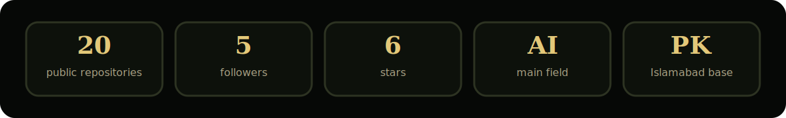
</p>

## The field

I am **Muzammil Haider**, an AI student and builder from Islamabad, Pakistan.

This profile is a farm because that is how I build.

I prepare the soil, plant the idea, remove the noise, watch the signals, and harvest something useful.

My work sits around complete AI systems:

- AI agents that reason, search, analyze, and automate
- RAG systems over PDFs, legal documents, and research papers
- ML dashboards for prediction and decision support
- backend APIs connected with databases and user facing apps
- Python automation for repetitive workflows
- practical tools that turn messy data into useful output

> I code for the love of the game.

<p align="center">
  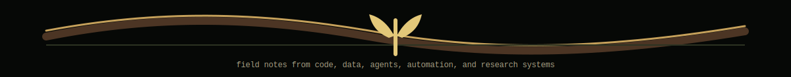
</p>

## Farm operating system

<p align="center">
  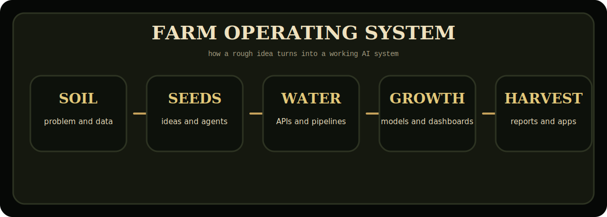
</p>

## Repository field map

<p align="center">
  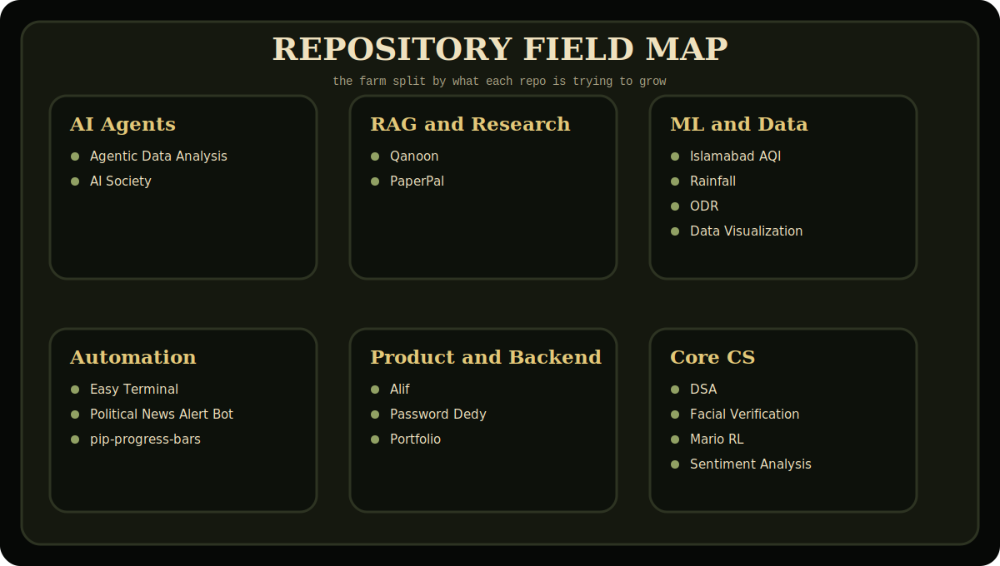
</p>

## What is growing right now

<table>
<tr>
<td width="33%">

### AI field

- LangChain agents
- LangGraph workflows
- RAG pipelines
- local LLM experiments
- research assistants

</td>
<td width="33%">

### Product field

- FastAPI backends
- dashboards
- automation tools
- database connected apps
- clean product flows

</td>
<td width="33%">

### Farm field

- real world thinking
- patience with systems
- practical output
- no empty decoration
- build and ship mindset

</td>
</tr>
</table>

<p align="center">
  
</p>

## Tools in the barn

<table>
<tr><td><b>Languages</b></td><td>Python, Kotlin, JavaScript, TypeScript, SQL, C++, Rust basics</td></tr>
<tr><td><b>AI and ML</b></td><td>PyTorch, TensorFlow, scikit-learn, OpenCV, YOLO, NLP, RAG, reinforcement learning</td></tr>
<tr><td><b>LLM systems</b></td><td>LangChain, LangGraph, Gemini, Ollama, FAISS, embeddings, vector search</td></tr>
<tr><td><b>Backend</b></td><td>FastAPI, Django, Django REST Framework, REST APIs, SMTP, IMAP</td></tr>
<tr><td><b>Data and dashboards</b></td><td>Pandas, NumPy, Power BI, Streamlit, analytics workflows, reports</td></tr>
<tr><td><b>Infra and tools</b></td><td>Docker, Supabase, PostgreSQL, pgvector, Linux, GitHub Actions, Selenium</td></tr>
</table>

<p align="center">
  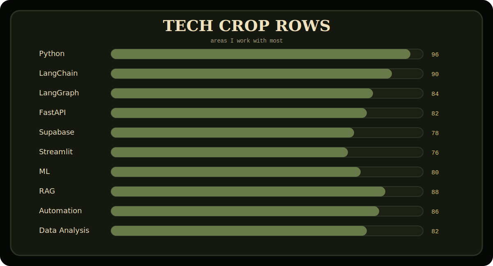
</p>

<p align="center">
  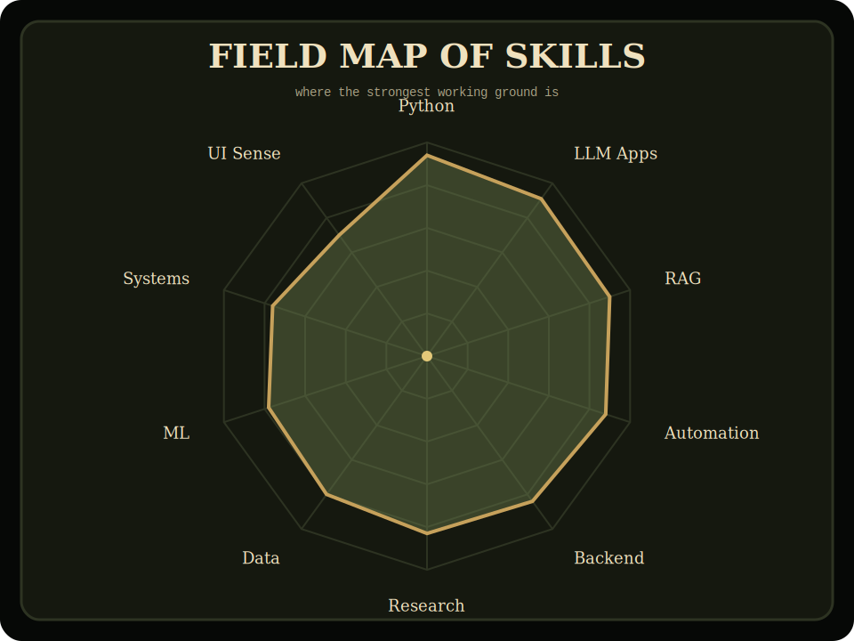
</p>

## Featured harvest

<table>
<tr>
<td width="50%"><a href="https://github.com/Haideransari444/Agentic-data-analysis">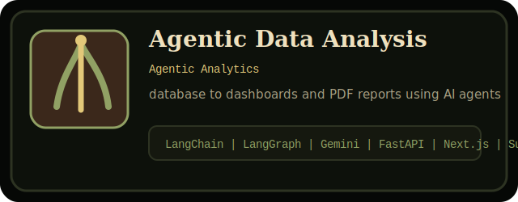</a></td>
<td width="50%"><a href="https://github.com/Haideransari444/islamabad-aqi-predictor">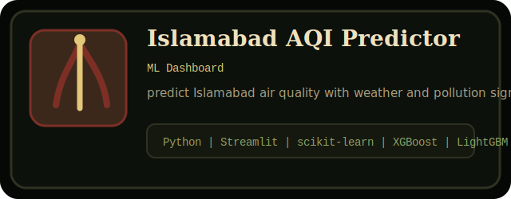</a></td>
</tr>
<tr>
<td width="50%"><a href="https://github.com/Haideransari444/Qanoon">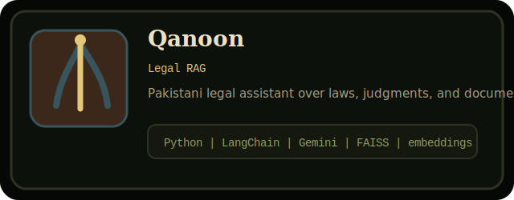</a></td>
<td width="50%"><a href="https://github.com/Haideransari444/PaperPal">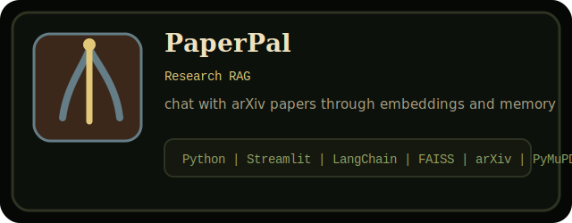</a></td>
</tr>
<tr>
<td width="50%"><a href="https://github.com/Haideransari444/Easy-Terminal">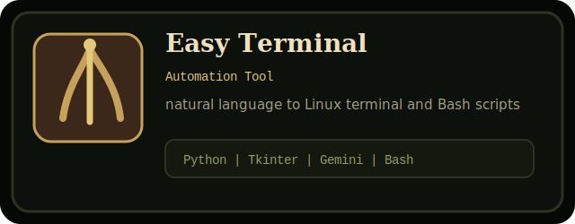</a></td>
<td width="50%"><a href="https://github.com/Haideransari444/AI-Society">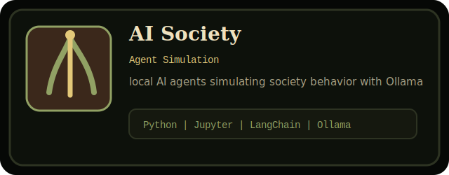</a></td>
</tr>
<tr>
<td width="50%"><a href="https://github.com/Haideransari444/Alif">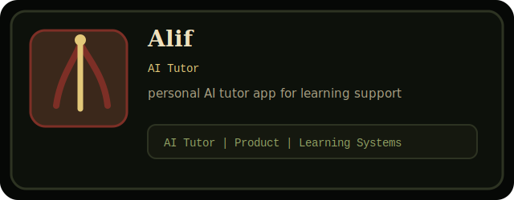</a></td>
<td width="50%"><a href="https://github.com/Haideransari444/password-dedy">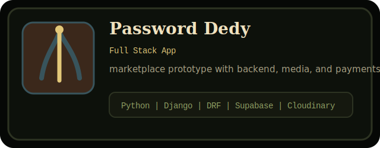</a></td>
</tr>
<tr>
<td width="50%"><a href="https://github.com/Haideransari444/Mario-Rl">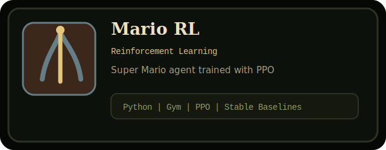</a></td>
<td width="50%"><a href="https://github.com/Haideransari444/Facial-Verification-System">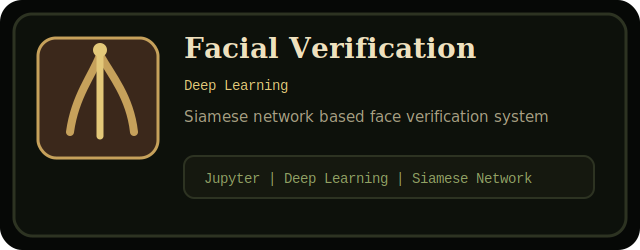</a></td>
</tr>
<tr>
<td width="50%"><a href="https://github.com/Haideransari444/ODR">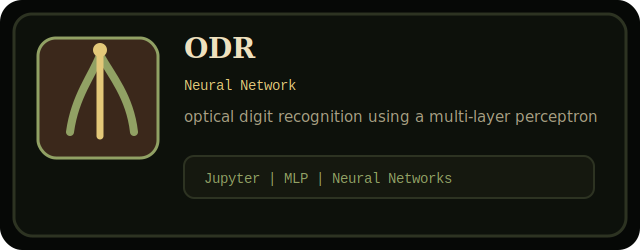</a></td>
<td width="50%"><a href="https://github.com/Haideransari444/Political-News-Alert-Bot">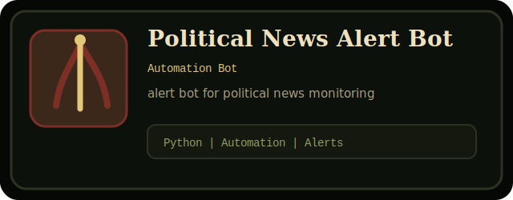</a></td>
</tr>
</table>

## Project notes

<table>
<tr><th>Project</th><th>Field</th><th>What it does</th><th>Stack</th></tr>
<tr><td><a href="https://github.com/Haideransari444/Agentic-data-analysis"><b>Agentic Data Analysis</b></a></td><td>Agentic Analytics</td><td>database to dashboards and PDF reports using AI agents</td><td><code>LangChain | LangGraph | Gemini | FastAPI | Next.js | Supabase</code></td></tr>
<tr><td><a href="https://github.com/Haideransari444/islamabad-aqi-predictor"><b>Islamabad AQI Predictor</b></a></td><td>ML Dashboard</td><td>predict Islamabad air quality with weather and pollution signals</td><td><code>Python | Streamlit | scikit-learn | XGBoost | LightGBM</code></td></tr>
<tr><td><a href="https://github.com/Haideransari444/Qanoon"><b>Qanoon</b></a></td><td>Legal RAG</td><td>Pakistani legal assistant over laws, judgments, and documents</td><td><code>Python | LangChain | Gemini | FAISS | embeddings</code></td></tr>
<tr><td><a href="https://github.com/Haideransari444/PaperPal"><b>PaperPal</b></a></td><td>Research RAG</td><td>chat with arXiv papers through embeddings and memory</td><td><code>Python | Streamlit | LangChain | FAISS | arXiv | PyMuPDF</code></td></tr>
<tr><td><a href="https://github.com/Haideransari444/Easy-Terminal"><b>Easy Terminal</b></a></td><td>Automation Tool</td><td>natural language to Linux terminal and Bash scripts</td><td><code>Python | Tkinter | Gemini | Bash</code></td></tr>
<tr><td><a href="https://github.com/Haideransari444/AI-Society"><b>AI Society</b></a></td><td>Agent Simulation</td><td>local AI agents simulating society behavior with Ollama</td><td><code>Python | Jupyter | LangChain | Ollama</code></td></tr>
<tr><td><a href="https://github.com/Haideransari444/Alif"><b>Alif</b></a></td><td>AI Tutor</td><td>personal AI tutor app for learning support</td><td><code>AI Tutor | Product | Learning Systems</code></td></tr>
<tr><td><a href="https://github.com/Haideransari444/password-dedy"><b>Password Dedy</b></a></td><td>Full Stack App</td><td>marketplace prototype with backend, media, and payments</td><td><code>Python | Django | DRF | Supabase | Cloudinary</code></td></tr>
<tr><td><a href="https://github.com/Haideransari444/Mario-Rl"><b>Mario RL</b></a></td><td>Reinforcement Learning</td><td>Super Mario agent trained with PPO</td><td><code>Python | Gym | PPO | Stable Baselines</code></td></tr>
<tr><td><a href="https://github.com/Haideransari444/Facial-Verification-System"><b>Facial Verification</b></a></td><td>Deep Learning</td><td>Siamese network based face verification system</td><td><code>Jupyter | Deep Learning | Siamese Network</code></td></tr>
<tr><td><a href="https://github.com/Haideransari444/ODR"><b>ODR</b></a></td><td>Neural Network</td><td>optical digit recognition using a multi-layer perceptron</td><td><code>Jupyter | MLP | Neural Networks</code></td></tr>
<tr><td><a href="https://github.com/Haideransari444/Political-News-Alert-Bot"><b>Political News Alert Bot</b></a></td><td>Automation Bot</td><td>alert bot for political news monitoring</td><td><code>Python | Automation | Alerts</code></td></tr>
<tr><td><a href="https://github.com/Haideransari444/Sentiment_Analysis"><b>Sentiment Analysis</b></a></td><td>NLP</td><td>sentiment analysis for WhatsApp chat data</td><td><code>NLP | Python | Text Analysis</code></td></tr>
<tr><td><a href="https://github.com/Haideransari444/Rain-Fall-Prediction"><b>Rainfall Prediction</b></a></td><td>ML Prediction</td><td>rainfall prediction using data driven ML methods</td><td><code>Jupyter | ML | Prediction</code></td></tr>
</table>

<p align="center">
  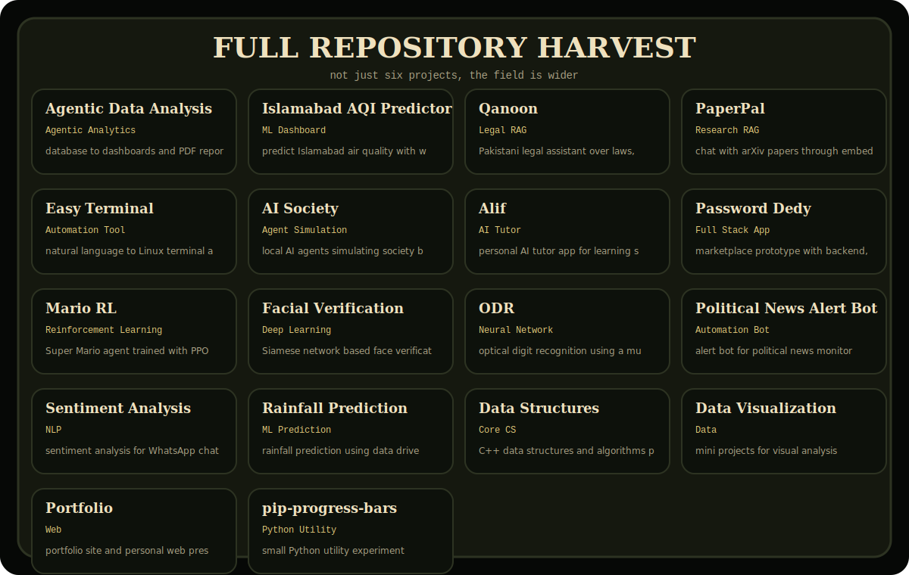
</p>

## Build timeline

<p align="center">
  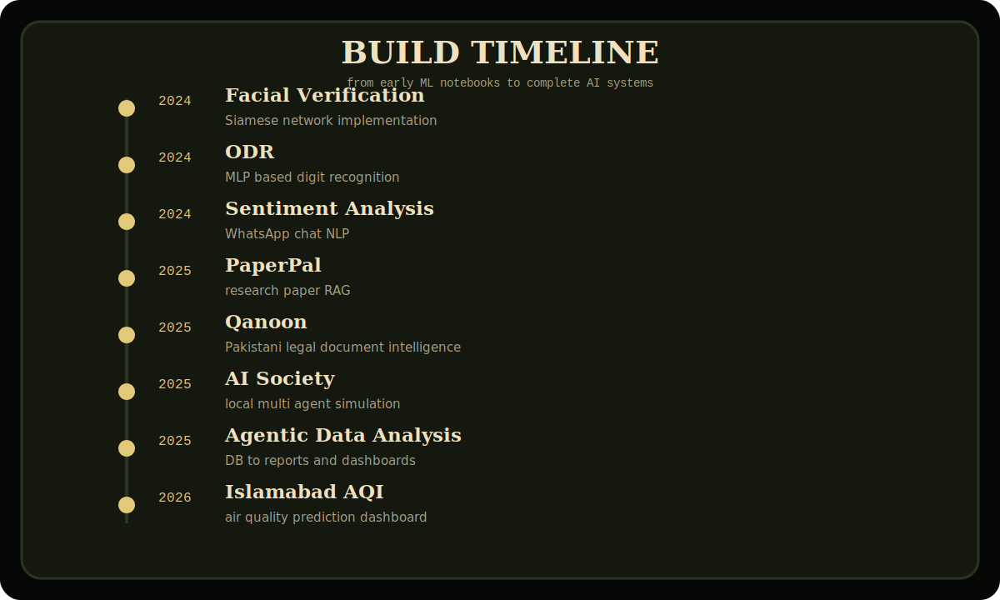
</p>

<p align="center">
  
</p>

## GitHub field report

<p align="center">
  
  
</p>

<p align="center">
  
</p>

<p align="center">
  
</p>


<p align="center">
  
  <br>
  <span style="color: #C6A15B; font-size: 13px;"><i>I code for the love of the game</i></span>
</p>


## Development style

```txt
1. understand the real problem
2. break it into small working parts
3. build the core logic first
4. connect it with real data
5. test it with realistic use cases
6. improve the interface
7. document what matters
8. ship the useful version
```

## Farm log

```txt
owner       Muzammil Haider
location    Islamabad, Pakistan
profile     cinematic rural AI builder
soil        Python, AI, backend, automation
water       curiosity, data, experiments
crop        agents, RAG systems, dashboards, tools
harvest     useful software, not decoration
music       use the play button above
```

## Connect

<p align="center">
  <a href="https://github.com/Haideransari444"></a>
  <a href="mailto:muzamilhaider444@gmail.com"></a>
  <a href="https://www.linkedin.com/in/muzamil-haider-89286329b"></a>
  <a href="https://www.youtube.com/watch?v=kwrYDTHKxiE"></a>
</p>

<p align="center"><b>Build it. Grow it. Ship it.</b></p>
